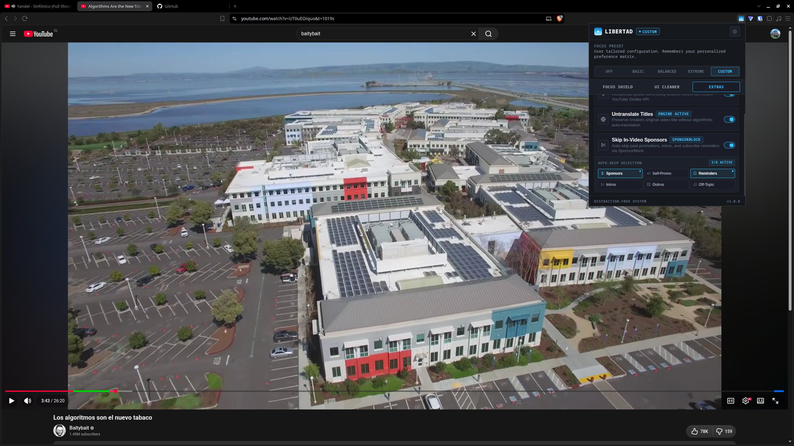
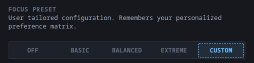
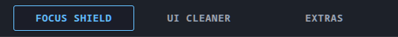
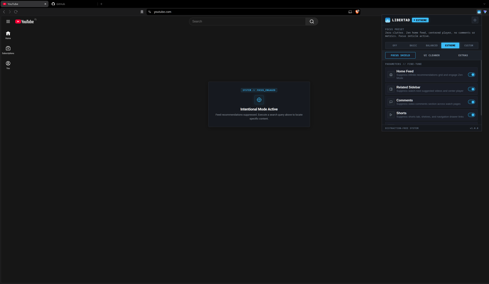
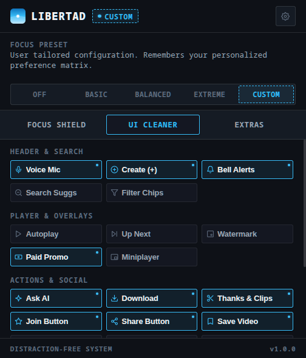
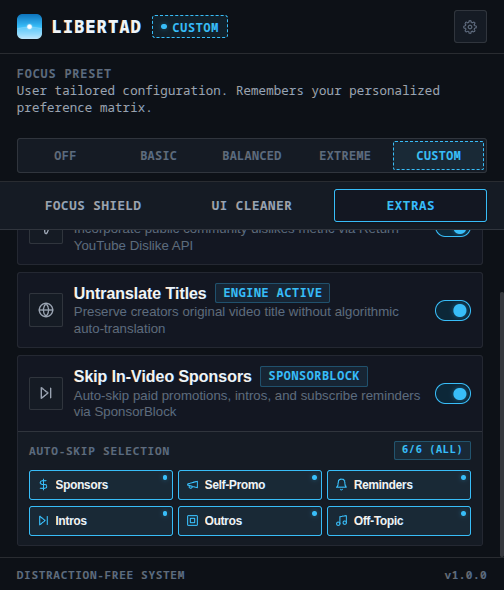
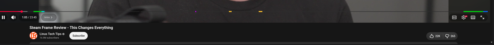
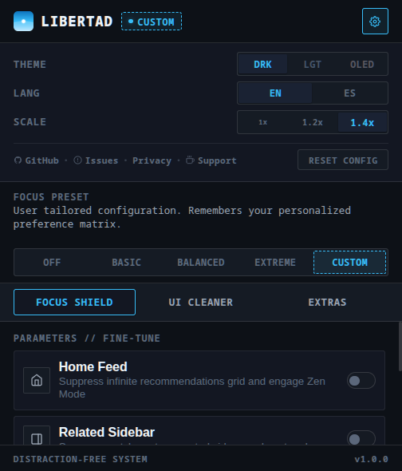
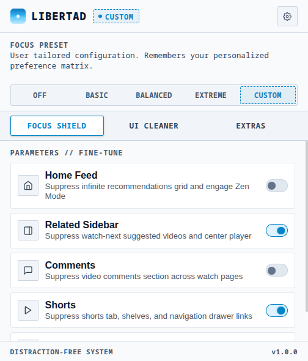
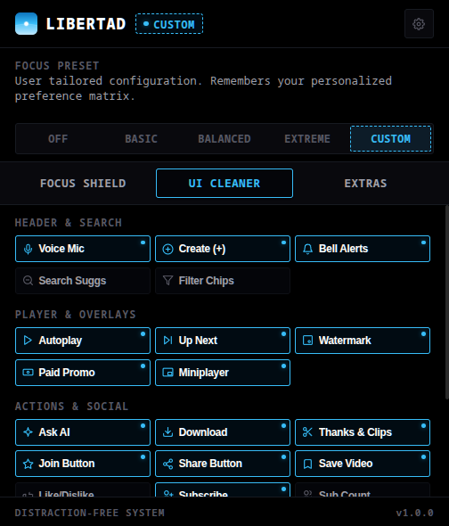

<p align="center">
  
</p>

<h1 align="center">Libertad — YouTube Focus & Distraction-Free</h1>

<p align="center">
  <strong>Reclaim your attention. Break algorithmic recommendation loops and experience YouTube with intention.</strong>
</p>

<p align="center">
  
  
  
  
  
</p>

<p align="center">
  
</p>

---

## Table of Contents

* [Overview](#overview)
* [At a Glance](#at-a-glance)
* [Key Features](#key-features)
  * [1. Global Preset Bar & Tri-Tab Navigation](#1-global-preset-bar--tri-tab-navigation)
  * [2. Instant Focus Presets](#2-instant-focus-presets-integrated-matrix)
  * [3. Granular Distraction Shields](#3-granular-distraction-shields-focus-tab)
  * [4. YouTube De-Bloating & Action Cleaner](#4-youtube-de-bloating--action-cleaner-cleaner-tab)
  * [5. Auxiliary Power Modules](#5-auxiliary-power-modules)
  * [6. Interface & Ergonomics](#6-interface--ergonomics)
* [Technical Architecture & Performance](#technical-architecture--performance)
* [Installation (Developer Mode)](#installation-developer-mode)
* [Quick Start & Usage](#quick-start--usage)
* [Development & Quality Checks](#development--quality-checks)
* [Building & Packaging](#building--packaging)
* [Privacy & Security](#privacy--security)
* [Acknowledgements](#acknowledgements)
* [Support & Donations](#support--donations)
* [License](#license)

---

## Overview

Modern video platforms are engineered around algorithmic feedback loops designed to maximize watch time rather than viewer intention. **Libertad** is an ultra-lightweight, high-performance browser extension built with pure vanilla web standards. It gives you complete control over YouTube's user interface, eliminating clutter, recommendations, and manipulative engagement mechanics.

Whether you need a distraction-free environment for research and study, or a minimalist aesthetic tailored to OLED displays, Libertad lets you watch what you chose to watch—and nothing else.

### At a Glance

* **One-Click Focus Presets**: Switch instantly between Off, Basic, Balanced (recommended default), and Extreme Zen modes.
* **Granular Surgical Control**: 31 modular toggles covering Home Feed, Direct to Subscriptions, watch-next sidebars, comments, shorts, and 25 UI clutter elements.
* **YouTube Power Utilities**: Restores public dislike metrics, auto-skips sponsored segments with a custom colored progress bar and one-click Undo/Unskip, and features a modular Untranslate Suite (Anti-AI Dubbing, Original Titles, Descriptions, Captions, Chapters).
* **Pure Vanilla Performance**: Zero frameworks, zero npm runtime dependencies, zero telemetry, and ultra-low memory footprint.

---

## Key Features

### 1. Global Preset Bar & Tri-Tab Navigation
Libertad organizes controls into three purpose-built workspaces without vertical clutter, commanded by a top-level global preset bar:

<p align="center">
  
</p>

* **Focus Shield**: High-impact macro distraction blockers for algorithmic feeds, watch-next sidebars, comments, shorts, and end-screen cards.
* **UI Cleaner**: Surgical removal of 25 promotional, experimental, and clutter elements across YouTube's modern interface organized into 4 distinct categories.
* **Extras**: Dedicated power modules for YouTube data restorations (Public Dislikes API), SponsorBlock segment skipping, and the Untranslate & Anti-AI Dubbing Suite.

<p align="center">
  
</p>

---

### 2. Instant Focus Presets (Integrated Matrix)
Switch between curated focus profiles with a single click or tailor your own (31 total toggles):

| Distraction / Clutter Element | OFF | BASIC | BALANCED *(Default)* | EXTREME *(Zen)* | CUSTOM |
| :--- | :---: | :---: | :---: | :---: | :---: |
| **Home Feed (Zen Search Mode)** | Shown | Shown | Shown | **Zen Prompt** | *Saved* |
| **Direct to Subscriptions** | Off | Off | Off | Off | *Saved* |
| **Related Sidebar & Recommendations** | Shown | Shown | **Hidden** | **Hidden** | *Saved* |
| **Comments Stream** | Shown | Shown | Shown | **Hidden** | *Saved* |
| **Shorts Everywhere (Feeds & Nav)** | Shown | Shown | **Hidden** | **Hidden** | *Saved* |
| **End Screen Popup Cards** | Shown | **Hidden** | **Hidden** | **Hidden** | *Saved* |
| **Header (Voice, Create, Notifs)** | Shown | Shown | **Hidden** | **Hidden** | *Saved* |
| **Search Suggestions & Filter Chips** | Shown | Shown | Shown | **Hidden** | *Saved* |
| **Player Overlays (Up Next, Promo, Watermark)** | Shown | **Hidden** | **Hidden** | **Hidden** | *Saved* |
| **Autoplay & Miniplayer Controls** | Shown | Shown | **Hidden** | **Hidden** | *Saved* |
| **Promo Buttons (AI, Download, Merch)** | Shown | **Hidden** | **Hidden** | **Hidden** | *Saved* |
| **Monetization Buttons (Join, Thanks/Clips)** | Shown | Shown | **Hidden** | **Hidden** | *Saved* |
| **Social Actions (Share, Save, 3-Dots)** | Shown | Shown | Shown | **Hidden** | *Saved* |
| **Metrics (Likes/Dislikes, Views, Subs)** | Shown | Shown | Shown | **Hidden** | *Saved* |
| **Feeds (Live Chat, Trending, More from YT)** | Shown | Shown | **Hidden** | **Hidden** | *Saved* |

* **Off**: Clean passthrough mode; leaves YouTube completely unaltered.
* **Basic**: Removes common passive watch clutter while keeping comments and feeds intact (suppresses end-screen cards, promotional download buttons, experimental AI popups, paid promo banners, watermarks, up next tiles, and merch shelves).
* **Balanced** *(Recommended Default)*: Breaks algorithmic recommendation feedback loops while keeping personal actions and comments accessible. Hides the sidebar (centering the player), shorts, autoplay, voice search mic, create button, notifications bell, up next, watermarks, paid promotions, miniplayer, AI button, download button, thanks/clips, channel memberships, merch shelves, live chat, trending, and "More from YouTube". Comments remain visible for timestamps, community code corrections, and tutorials.
* **Extreme (Zen Mode)**: Complete distraction and engagement eradication ("Monk Mode"). Replaces the homepage with an intentional minimalist search prompt, hides the sidebar, **hides comments**, shorts, header tools, player overlays, action bar (including likes/dislikes, share, save, 3-dots menu, subscribe button, subscriber count, views/date), live chat, and all browsing shelves.
* **Custom**: Automatically remembers and persists your individual fine-tuned preferences across all 31 switches in both tabs.

---

### 3. Granular Distraction Shields (Focus Tab)

<p align="center">
  
</p>

* **Home Feed & Zen Mode**: Suppresses the infinite video recommendation grid on the homepage (`/`). When enabled, displays an intentional, minimalist search prompt that encourages purposeful searches rather than passive scrolling.
* **Direct to Subscriptions**: Optionally redirects the YouTube homepage (`/`) directly to your chronological Subscriptions feed (`/feed/subscriptions`), allowing you to view your subscribed creators without algorithmic recommendation traps.
* **Related Sidebar & Auto-Centering**: Removes watch-next suggestions and algorithmically recommended videos beside the player. Automatically centers the main video player in theater style to prevent awkward whitespace.
* **Comments Section**: Hides the entire comment stream across all video watch pages to avoid engagement traps and toxic comment sections.
* **Shorts Eradication & Redirection**: Strips Shorts shelves, channel tabs (`/@channel/shorts`), navigation drawer links, mini-guide buttons, modern view-models (`ytm-shorts-lockup-view-model`), and feed/search entries across YouTube. Automatically redirects direct `/shorts/` URLs to the standard watch player (`/watch?v=`) and channel `/shorts` tabs directly to the channel's standard `/videos` feed.
* **End Screen Cards**: Suppresses popup overlay cards, subscribe buttons, and teaser cards that obstruct the final seconds of videos.

---

### 4. YouTube De-Bloating & Action Cleaner (Cleaner Tab)

Libertad provides 25 modular toggles organized into four specialized categories to clean modern YouTube:

<p align="center">
  
</p>

#### A. Header & Search Controls
* **Voice Search Mic**: Removes the microphone icon beside the main search bar for a cleaner masthead.
* **Create / Upload Button**: Suppresses the video creation and live broadcast button (`+`) in YouTube's top masthead bar.
* **Notifications Bell**: Suppresses the notification bell and alert badges to eliminate anxiety and notification rabbit holes.
* **Search Suggestions**: Hides the autocomplete search suggestion dropdown box to prevent algorithmic search hijacking.
* **Feed Filter Chips**: Suppresses the category topic chips bar located at the top of feeds and search results.

#### B. Player Controls & Overlays
* **Autoplay Toggle**: Hides the autoplay switch in the bottom video player control bar to prevent unintended binge-watching.
* **Up Next Overlay Tile**: Suppresses the countdown screen and "Up Next" preview tiles overlaying the video player.
* **Channel Branding Watermark**: Removes the floating creator watermark icon in the bottom-right corner of the video.
* **Paid Promotion / Sponsor Banners**: Suppresses the "Includes paid promotion" banner disclaimer overlaying the video.
* **Miniplayer Button**: Removes the picture-in-picture / miniplayer button from the player controls.

#### C. Action Bar & Social Engagement
* **Ask AI Assistant Button**: Suppresses YouTube's experimental conversational AI button on video watch pages.
* **Promotional Download Button**: Suppresses the download button and its overflow menu entries prompting users to purchase YouTube Premium.
* **Thanks, Clips & Remix**: Strips monetization and remixing action buttons from the primary video control bar.
* **Channel Memberships (Join Button)**: Suppresses the promotional "Join" / "Unirse" button beside the Subscribe button.
* **Video Share Button**: Suppresses the share button for an ultra-focused, cinema-grade watch experience.
* **Save to Playlist**: Suppresses the "Save" to playlist button from the primary video action bar.
* **Like / Dislike Bar**: Strips the thumbs up and thumbs down action buttons from the player metadata row.
* **Subscribe Button**: Suppresses the channel Subscribe button to avoid audience capture traps.
* **Subscriber Count**: Hides the channel subscriber count to prevent social proof bias.
* **View Count & Upload Date**: Suppresses public view counts and publication dates beneath the video title.
* **3-Dots Overflow Menu**: Suppresses the 3-dots "More actions" (`...`) button on the watch action bar and removes the "Report" / "Denunciar" option from overflow menus.

#### D. Feeds & Navigation Shelves
* **Merch & Shopping Shelves**: Suppresses shopping carousels, affiliate product shelves, and store banners below videos.
* **Live Chat Stream & Replay**: Suppresses the live chat sidebar, chat replay, and live comment box during premieres and streams.
* **Trending & Explore**: Strips Trending, Movies, and Explore links from the left guide drawer and feed sections.
* **More From YouTube**: Suppresses YouTube Premium, YouTube Studio, YouTube Music, and YouTube Kids sections in the navigation drawer.

---

### 5. Auxiliary Power Modules

<p align="center">
  
</p>

<p align="center">
  
</p>

* **Restore YouTube Dislikes**:
  * Seamlessly connects to the community-driven [Return YouTube Dislike API](https://returnyoutubedislikeapi.com).
  * Injects public dislike metrics directly into the native YouTube action bar with localized formatting (`1.4K`, `25M`).
  * Features an in-memory cache to prevent redundant network requests and maximize responsiveness.

* **Untranslate & Anti-AI Dubbing Suite**:
  * **Original Audio & Anti-AI Dubbing**: Employs an isolated player agent running in YouTube's execution context (`world: "MAIN"`) to intercept native player audio track controls, neutralizing forced multilingual AI/synthetic dubs and locking playback to the creator's genuine vocal performance across multiple language variants.
  * **Original Video Titles**: Reverses automatic title translations across both watch pages and video feeds using an `IntersectionObserver` viewport scanner with bounded concurrency (`MAX_CONCURRENT_FEED_FETCHES = 3`) to eliminate redundant traffic and prevent rate limits.
  * **Authentic Descriptions**: Restores the creator's original video description, maintaining the true text even after expanding the description container ("Show more" / "...more").
  * **Subtitles & Captions Normalization**: Prevents forced auto-translated caption tracks from displaying automatically.
  * **Timeline Chapters**: Reverts translated chapter timestamps and titles along the player scrubber back to their original text.
  * **Modular SponsorBlock-Style UX**: Master toggle switch accompanied by 5 interactive category chips with a real-time active counter badge (`X/5 ACTIVAS` / `X/5 ACTIVE`).

* **Skip In-Video Sponsors (SponsorBlock Engine)**:
  * Automatically detects and skips sponsored segments and subscribe reminders without requiring manual interaction.
  * Features a visual colored progress bar overlay rendering segment markers in their authentic categories (Green for sponsors, Yellow for self-promo, Purple for reminders, Blue for outros, Cyan for intros).
  * Provides granular sub-controls: auto-skips intrusive sponsors and subscribe reminders by default, while **preserving outros and endcards** so you can enjoy closing scenes and music unless you explicitly choose to skip them.
  * Connects to the open [SponsorBlock](https://sponsor.ajay.app) community database, showing a subtle on-screen toast whenever a segment is skipped.
  * **Interactive Unskip (Undo)**: Toast notifications feature an on-screen **"UNSKIP" / "DESHACER" / "DESFAZER"** button, allowing you to instantly reverse any auto-skip with a single click if you want to watch that specific segment.
  * Driven by native HTML5 `<video>` playback events and an in-memory segment cache for 0.0% idle CPU overhead.

---

### 6. Interface & Ergonomics

<p align="center">
  
</p>

* **Tri-Theme Engine (with OS Auto-Detection)**:
  * **Auto**: Dynamically listens to the operating system's color scheme (`prefers-color-scheme`) in real time, automatically switching between Light and Dark modes.
  * **Dark**: Industrial graphite palette with high readability.
  * **Light**: Clean, high-contrast laboratory aesthetic.
  * **OLED**: Pure `#000000` pitch black engineered for OLED displays and maximum power efficiency.

<p align="center">
  
  &nbsp;&nbsp;
  
</p>

* **UI Display Scaling (with DPI Auto-Detection)**:
  * **Auto**: Evaluates monitor resolution and physical device pixel ratio (`window.devicePixelRatio`) to automatically calibrate the optimal UI scale (100%, 120%, or 140%).
  * **Manual Controls**: One-touch zoom overrides for custom popup comfort: **1x** (Standard), **1.2x** (1440p / 2K), and **1.4x** (4K / Ultrawide).
* **Trilingual Localization (i18n)**:
  * **Auto**: Automatically matches the browser language (`navigator.language` & `chrome.i18n`), launching natively in Portuguese for lusophone locales (`pt-BR`, `pt-PT`, etc.), Spanish for hispanophone locales (`es-419`, `es-ES`, etc.), and English for all others.
  * **Manual Controls**: Instant one-click toggles between **English (EN)**, **Spanish (ES)**, and **Portuguese (PT)** for all popup controls, tooltips, and on-screen banners.

---

## Technical Architecture & Performance

* **Zero External Runtime Dependencies**: Built with 100% pure Vanilla JavaScript, modern HTML5, and CSS variables. Zero npm bloat, zero bundlers required.
* **Modular Clean Architecture**: Cleanly decoupled into `src/core/` (Cache, Utilities), `src/injected/` (Main-World Player Agent), and `src/modules/` (Styles, Shorts, Subscriptions, Dislikes, Sponsors, Untranslate), coordinated by a lightweight orchestrator ([content.js](content.js)) without any build-step complexity.
* **Isolated Main-World Player Agent (`world: "MAIN"`)**: Injects an isolated player agent ([src/injected/agent.js](src/injected/agent.js)) at `document_start` to interface directly with YouTube's internal player APIs (`ytplayer`, `setAudioTrack`, `getAudioTrack`). Safely neutralizes AI auto-dubbing and extracts un-localized video models without monkey-patching `window.fetch` or conflicting with adblockers.
* **Reverse-FOUC Elimination**: Synchronous `sessionStorage` hydration at `document_start` completely eliminates reverse flash of unstyled content on hard page reloads before asynchronous storage resolves.
* **Two-Level Service Worker Caching**: Background service worker employs L1 in-memory caching combined with L2 `chrome.storage.session` persistence, allowing cached SponsorBlock segments and Return YouTube Dislike metrics to survive Service Worker lifecycle suspensions without redundant network calls.
* **SPA Lifecycle Integration & Capture Routing**: Listens to YouTube's internal single-page navigation events (`yt-navigate-start`, `yt-navigate-finish`, `popstate`) and intercepts link clicks in the capture phase to enable instant, zero-reload navigation.
* **Granular Reactive Diffing**: Reactively listens to `chrome.storage.onChanged` with granular key-level diffing, updating only the specific module affected by a toggle rather than triggering expensive full re-renders.
* **Bounded LRU Memory Cache**: Memory stores for titles, segments, and dislike metrics are strictly capped using an LRU eviction strategy to prevent memory leaks during long-running SPA sessions.
* **Manifest V3 Compliant**: Built strictly adhering to the latest Chrome Extension security standards.

```text
Focus_extension/
├── _locales/              # Chrome Web Store internationalization (en, es, pt_BR, pt_PT)
├── icons/                 # Extension brand iconography (16, 48, 128px)
├── src/
│   ├── core/
│   │   ├── cache.js       # Bounded LRU Cache implementation
│   │   └── utils.js       # Video ID parser, compact number i18n & locale detection
│   ├── injected/
│   │   └── agent.js       # Main-world player API agent (Anti-AI dubbing & raw metadata)
│   └── modules/
│       ├── dislikes.js    # Return YouTube Dislike API engine & badge injector
│       ├── shorts.js      # Shorts blocker and watch player redirector
│       ├── sponsors.js    # SponsorBlock skipping engine & timeline progress bar
│       ├── styles.js      # Dynamic stylesheet compiler & Zen Mode interface
│       ├── subscriptions.js # Direct-to-subscriptions SPA link interceptor
│       └── untranslate.js # Viewport title untranslation & Untranslate Suite coordinator
├── background.js          # Service worker with 2-level persistent caching
├── constants.js           # Single source of truth for presets and toggle keys
├── content.js             # High-speed orchestrator and SPA navigation router
├── i18n.js                # Trilingual dictionary (EN, ES, PT)
├── popup.html             # Tri-tab control surface with settings drawer
├── popup.css              # Themeable CSS design system
├── popup.js               # Interaction controller with automatic system detection
├── theme-init.js          # Synchronous anti-FOUC theme & scale bootstrapper
└── pack.py                # Automated Chrome Web Store packaging script
```

---

## Installation (Developer Mode)

To install and test Libertad locally in any Chromium-based browser (Google Chrome, Brave, Edge, Opera, Vivaldi):

1. Clone or download this repository:
   ```bash
   git clone https://github.com/HumbleDev-tech/Focus_extension.git
   ```
2. Open your browser and navigate to the extensions management page:
   * **Chrome / Brave**: `chrome://extensions/`
   * **Edge**: `edge://extensions/`
3. Enable **Developer mode** via the toggle switch in the top-right corner.
4. Click **Load unpacked** and select the root directory of this repository (`Focus_extension`).
5. Pin **Libertad** to your browser toolbar and open [YouTube](https://www.youtube.com).

---

## Quick Start & Usage

1. **Choose a Preset**: Open the popup from your browser toolbar and choose your focus profile (`OFF`, `BASIC`, `BALANCED`, or `EXTREME`). `BALANCED` is recommended for daily study and research.
2. **Fine-Tune Elements**: Navigate between the **Focus Shield** and **UI Cleaner** tabs to toggle individual elements. Toggling any switch automatically preserves your settings under `CUSTOM`.
3. **Configure Utilities**: In the **Extras** tab, customize which SponsorBlock segments to auto-skip (Sponsors, Self-Promo, Reminders, Intros, Outros, Off-Topic) or keep them in view-only mode on the timeline, and tailor the Untranslate Suite (toggle original audio / anti-AI dubbing, titles, descriptions, captions, and chapters via interactive chips).
4. **Adjust Preferences**: Click the gear icon in the top header to customize Dark, Light, or OLED themes, select interface scale (1x, 1.2x, 1.4x), or change language between English, Spanish, and Portuguese—all supporting fully automatic system detection via the **AUTO** modes.

---

## Development & Quality Checks

This project uses **[Biome](https://biomejs.dev)** for ultra-fast linting, formatting, and accessibility checks:

```bash
# Check formatting, linter rules, and syntax standards
npm run check

# Automatically format all source files
npm run format

# Run linter only
npm run lint
```

---

## Building & Packaging

The repository includes an automated packaging script to build clean distribution `.zip` archives ready for upload to the [Chrome Web Store Developer Dashboard](https://chrome.google.com/webstore/devconsole):

### Using npm:
```bash
npm run pack
```

### Using Python:
```bash
python3 pack.py
```

The script automatically filters out git metadata, editor files, and temporary artifacts, outputting `libertad-extension.zip`.

---

## Privacy & Security

Libertad is built on strict privacy-first principles:

* **Zero Telemetry**: Contains no tracking scripts, analytics, or behavioral loggers.
* **On-Device Execution**: All preferences and configurations are stored locally or synced strictly within your browser's private `chrome.storage.sync`.
* **Minimal Permissions**: Requests only the permissions strictly necessary to function (`storage` and YouTube host access).

Read our full [Privacy Policy](PRIVACY.md) for complete details.

---

## Acknowledgements

Libertad is built on open standards and stands on the shoulders of exceptional open-source projects and community initiatives:

* **[Return YouTube Dislike](https://returnyoutubedislike.com)**: For providing the public community API and infrastructure that powers our dislike metric restoration module.
* **[SponsorBlock](https://sponsor.ajay.app)**: For providing community-curated sponsorship timestamps licensed under [CC BY-NC-SA 4.0](https://creativecommons.org/licenses/by-nc-sa/4.0/). Uses SponsorBlock data from [https://sponsor.ajay.app/](https://sponsor.ajay.app/).
* **[Feather Icons](https://feathericons.com)** / **[Lucide](https://lucide.dev)**: For the clean, open-source SVG line iconography utilized across the popup control surface.
* **[Biome](https://biomejs.dev)**: For providing world-class, ultra-fast formatting and linting tooling.
* **YouTube Untranslate Community**: Inspired by open-source community research and scripts exploring client-side metadata preservation and anti-translation techniques.
* **Distraction-Free Community**: Inspired by the pioneering ethos of tools like *Unhook* and *DF Tube*, re-engineered with zero runtime dependencies and modern Manifest V3 standards.

---

## Support & Donations <a id="support--donations"></a>

Libertad is **100% free, unmonetized, and open-source** under the MIT license. We believe essential focus and digital sovereignty tools should belong to everyone without paywalls, subscriptions, or telemetry.

If Libertad saves you hours of distraction and you'd like to support continued development, maintenance, and new features, voluntary contributions are deeply appreciated:

* **Ko-fi**: [ko-fi.com/humbledevtech](https://ko-fi.com/humbledevtech)

Every bit of support fuels independent, open-source software built for user autonomy.

---

## License

This project is open-source software licensed under the **[MIT License](LICENSE)**.  
Created and maintained by **[HumbleDev-tech](https://github.com/HumbleDev-tech)**.

