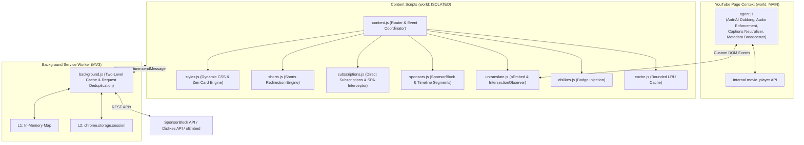

<p align="center">
  
</p>

<h1 align="center">Libertad for YouTube — Focus & Distraction-Free</h1>

<p align="center">
  <strong>Reclaim your attention. Watch what you actually chose to watch — without feeds, shorts, clickbait, or forced AI dubs pulling you in.</strong>
</p>

<p align="center">
  
  
  
  
  
  
</p>

---

## Table of Contents

* [Why Libertad?](#why-libertad)
* [Focus Profiles & Presets](#focus-profiles--presets)
* [Granular Features](#granular-features)
  * [Focus Shield (Macro Distraction Blockers)](#focus-shield)
  * [UI Cleaner (Micro-De-Bloat Matrix)](#ui-cleaner)
* [Power Utilities (Extras)](#power-utilities-extras)
  * [Restore Public Dislikes](#1-restore-public-dislikes)
  * [SponsorBlock with Visual Timeline & Smart Rewind](#2-sponsorblock-integration)
  * [Untranslate & Anti-AI Dubbing Suite](#3-untranslate--anti-ai-dubbing-suite)
* [Themes, Scaling & Ergonomics](#themes-scaling--ergonomics)
* [High-Performance Architecture](#high-performance-architecture)
* [Installation (Developer Mode)](#installation-developer-mode)
* [Development & Packaging](#development--packaging)
* [Project Structure](#project-structure)
* [Privacy & Permissions](#privacy--permissions)
* [Acknowledgements](#acknowledgements)
* [Support the Project](#support-the-project)
* [License](#license)

---

## Why Libertad?

Modern YouTube is engineered to capture and monetize your attention: infinite algorithmic recommendation traps, endless Shorts, clickbait titles translated against your will, forced synthetic AI audio dubs, and visual clutter designed to keep you clicking.

**Libertad** restores intentionality to YouTube. It gives you complete sovereignty over what you see, hear, and experience:

* **Zero Bloat, 100% Pure Vanilla JS:** Built with zero npm runtime dependencies and zero framework overhead (no React, no Vue). It boots synchronously at `document_start` with zero reverse-FOUC (Flash of Unstyled Content) and negligible memory footprint.
* **3 Dedicated Isolated Profiles:** Switch seamlessly between customizable contexts (e.g., **Work / Deep Focus**, **Relax / Podcasts**, **Personal**). Each profile maintains isolated toggle states and supports inline renaming with keyboard shortcuts.
* **Curated Base Presets:** One-click baseline templates (`OFF`, `BASIC`, `BALANCED`, `EXTREME / Zen`) configure your active profile instantly, while retaining granular fine-tuning for all 31 individual switches.
* **Zen Mode Intentional Home:** Replaces the addictive infinite home feed with a calm, theme-aware focus card directing your attention to intentional search.
* **Shorts Eradication & Redirection:** Eliminates Shorts shelves, navigation links, and reels, while automatically redirecting `/shorts/` URLs to the standard desktop player (`/watch?v=`) with full scrubber and speed controls.
* **Smart SponsorBlock Integration:** Color-coded timeline progress segments, 6 skip categories, rich toast notifications with duration badges, an instant **Unskip** button, and **Smart Manual Rewind Detection** that automatically cancels skips when you scrub back.
* **Untranslate & Anti-AI Dubbing Suite:** An isolated agent running in the YouTube `MAIN` world locks playback to the creator's genuine voice, bypasses forced multilingual AI dubs, and restores original titles, descriptions, and chapters.
* **Restores Public Dislikes:** Community-powered dislike counter integrated directly into YouTube's native action buttons with localized formatting.
* **Strictly Privacy-First:** Zero telemetry, zero analytics, zero tracking scripts, and minimal permissions. All configuration stays on your device.

---

## Focus Profiles & Presets

Libertad provides **3 independent focus profiles** to match your daily workflow contexts:

| Profile Slot | Default Name | Default Preset | Primary Purpose |
| :--- | :--- | :---: | :--- |
| **P1** | **Work** / *Trabajo* | `EXTREME` | Deep study, programming, and research. Feed suppressed, reticle active, comments hidden. |
| **P2** | **Relax** / *Relax* | `BALANCED` | Casual watching and podcasts. Sidebar hidden, player centered, comments preserved. |
| **P3** | **Personal** / *Pessoal* | `BASIC` | Clean baseline. Shorts eradicated, overlays removed, recommendations retained. |

> **Profile Switching & Inline Renaming:**  
> * Click any profile pill (`P1`, `P2`, `P3`) to switch active contexts instantaneously.  
> * Click the pencil icon (✎) or double-click to rename any profile inline. Press <kbd>Enter</kbd> to save or <kbd>Esc</kbd> to cancel.  
> * Modifying any switch saves strictly to the active profile without altering the others.

### Base Presets Matrix

Apply a baseline preset directly to your active profile, or toggle any individual control:

| Element / Switch | OFF | BASIC | BALANCED *(Default)* | EXTREME *(Zen)* |
| :--- | :---: | :---: | :---: | :---: |
| **Home Feed (Zen Screen)** | Shown | Shown | Shown | **Minimal Search** |
| **Direct to Subscriptions** | Off | Off | Off | Off |
| **Related Sidebar & Up Next** | Shown | Shown | **Hidden** | **Hidden** |
| **Shorts (Shelves, Nav & Redirects)** | Shown | **Hidden** | **Hidden** | **Hidden** |
| **End Screen Cards & Teasers** | Shown | **Hidden** | **Hidden** | **Hidden** |
| **Comments Stream & Panels** | Shown | Shown | Shown | **Hidden** |
| **Header (Voice Mic, Create, Bell)** | Shown | Shown | **Hidden** | **Hidden** |
| **Search Suggestions & Filter Chips** | Shown | Shown | Shown | **Hidden** |
| **Player Overlays & Watermarks** | Shown | **Hidden** | **Hidden** | **Hidden** |
| **Autoplay & Miniplayer** | Shown | Shown | **Hidden** | **Hidden** |
| **Promotional (Ask AI, Download, Merch)** | Shown | **Hidden** | **Hidden** | **Hidden** |
| **Monetization (Join, Thanks, Clips)** | Shown | Shown | **Hidden** | **Hidden** |
| **Social Actions (Share, Save, 3-Dots)** | Shown | Shown | Shown | **Hidden** |
| **Video Metrics (Likes, Views, Subs)** | Shown | Shown | Shown | **Hidden** |
| **Feeds (Live Chat, Trending, More from YT)** | Shown | Shown | **Hidden** | **Hidden** |

*Note: Modifying any toggle switch while a preset is active smoothly marks the preset indicator as `CUSTOM`.*

---

## Granular Features

Controls are neatly divided across three ergonomic tabs in the popup:

### Focus Shield

High-impact structural blockers for algorithmic distraction loops:

* **Home Feed & Zen Mode:** Suppresses infinite recommendation grids, chip rows, and skeleton ghosts. When active, injects a responsive **Zen Mode Intentional Screen** featuring the Libertad brand header, glowing live focus indicator (`FOCUS ACTIVE`), focus reticle icon, and search prompt. Dynamically adapts to your chosen theme and DPI scale.
* **Direct to Subscriptions:** Automatically redirects YouTube home (`/`) to your subscribed creators feed (`/feed/subscriptions`). Features an SPA link interceptor that routes clicks on the YouTube logo and drawer links instantly without page reloads.
* **Related Sidebar Suppression & Auto-Centering:** Eliminates the "Up Next" suggested video sidebar on watch pages and automatically centers the primary video player (`max-width: 1100px; margin: 0 auto;`).
* **Comments Suppression:** Blocks the `#comments` stream and side engagement comment drawers.
* **Shorts Eradication & Active Redirection:**
  * Hides Shorts shelves, feed cards, lockup view models, channel tabs, and navigation drawer links.
  * **Intelligent Redirection Engine:** Automatically converts `/shorts/VIDEO_ID` into the desktop player `/watch?v=VIDEO_ID` with standard controls, timeline scrubbing, speed modifiers, and theater mode.
  * Redirects channel shorts tabs (`/@channel/shorts`) to the channel videos list (`/@channel/videos`).
* **End Screen Cards:** Hides intrusive post-video recommendation tiles, channel popups, and teaser cards before they obstruct playback.

### UI Cleaner

25 modular micro-de-bloat switches categorized into 4 distinct groups:

1. **Header & Search (5 switches):**
   * *Voice Mic:* Hides voice search microphone from masthead and searchbox.
   * *Create (+):* Hides upload / video creation button.
   * *Bell Alerts:* Hides notification bell and badge counters.
   * *Search Suggestions:* Disables autocomplete suggestion dropdowns.
   * *Filter Chips:* Hides top topic filter pills across feeds.
2. **Player Controls & Overlays (5 switches):**
   * *Autoplay:* Hides inline autoplay toggle switch in the player bar.
   * *Up Next:* Suppresses automatic countdown tiles and up-next overlays.
   * *Watermark:* Removes channel branding watermark in player bottom-right corner.
   * *Paid Promo:* Hides "Includes paid promotion" banner badges.
   * *Miniplayer:* Hides miniplayer toggle button.
3. **Action Buttons (7 switches):**
   * *Ask AI:* Hides Gemini / conversational AI summary buttons.
   * *Download:* Hides YouTube Premium video download button.
   * *Thanks & Clips:* Hides Super Thanks, Clip creation, and Remix buttons.
   * *Join Button:* Hides channel membership promotion buttons.
   * *Share Button:* Hides video sharing button.
   * *Save Video:* Hides "Save to playlist" button.
   * *3-Dots Menu:* Hides secondary action overflow menu.
4. **Metrics & Social Counters (4 switches):**
   * *Like/Dislike:* Hides like and dislike buttons and counter displays.
   * *Subscribe:* Hides the channel subscribe button.
   * *Sub Count:* Hides public channel subscriber numbers.
   * *Views & Date:* Hides view counters and relative upload timestamps.
5. **Feeds & Navigation (4 switches):**
   * *Merch Shelf:* Hides product shelves, store carousels, and shopping drawers.
   * *Live Chat:* Hides live stream chat boxes and replay drawers.
   * *Trending:* Hides trending and explore guide links.
   * *More YouTube:* Hides YouTube Premium, Studio, and YouTube TV sections from the guide.

---

## Power Utilities (Extras)

In the **Extras** tab, Libertad bundles three community-backed power modules:

### 1. Restore Public Dislikes

Integrates with the public [Return YouTube Dislike API](https://returnyoutubedislikeapi.com):

* Injects a native-looking dislike badge directly beside the dislike thumbs-down icon inside modern segmented buttons (`yt-spec-button-shape-next`).
* Formats metrics using localized compact notation (`1.2K`, `50M` in EN; `1,2 K`, `50 M` in ES/PT).
* Dual-layer caching and in-flight Promise deduplication eliminate redundant network requests.

### 2. SponsorBlock Integration

Skips sponsor segments, intros, self-promotions, and subscribe reminders using community-driven timestamps from [SponsorBlock](https://sponsor.ajay.app):

* **Visual Color-Coded Timeline:** Renders segments directly on the YouTube player progress bar with distinct category colors:
  * 🟢 **Sponsor:** `#00d406` (Paid promotions)
  * 🟡 **Self-Promo:** `#fbc02d` (Creator self-promotions & merch)
  * 🟣 **Interaction:** `#cc00ff` (Subscribe & like reminders)
  * 🔵 **Intro / Recap:** `#00d8d8` (Opening recaps & logos)
  * 🔷 **Outro:** `#0268ed` (Closing endcards & credits)
  * 🔹 **Preview:** `#008fd6` (Upcoming recaps)
  * 🟠 **Music Off-Topic:** `#ff9900` (Non-music dialogues in music videos)
  * Includes hover tooltips displaying category name and timestamp ranges.
* **6 Granular Skip Categories:** Toggle individual segment types directly from the popup Extras panel with a live active counter badge (`3/6 ACTIVE`).
* **Rich On-Screen Toast Notification:** Displays an animated fast-forward icon, localized category label (`SPONSOR SKIPPED`, `PATROCINIO SALTADO`, etc.), and a duration badge showing exact seconds saved (`· 15s`). Automatically inherits your active theme and UI scale.
* **Interactive Undo / Unskip:** Click the on-screen **"UNSKIP" / "DESHACER" / "DESFAZER"** button to jump back to before the segment and whitelist that segment UUID for the rest of playback.
* **Smart Manual Rewind Detection:** If you manually scrub back across a skipped segment using arrow keys, keyboard shortcuts (<kbd>J</kbd>), or the timeline, Libertad automatically detects the rewind, unskips the segment, dismisses the toast, and lets you watch it. Rewinding earlier safely re-arms the segment. Built-in programmatic skip detection prevents false triggers.

### 3. Untranslate & Anti-AI Dubbing Suite

Neutralizes YouTube's forced multilingual translations and synthetic voice cloning:

* **Anti-AI Dubbing & Authentic Audio Enforcement:**
  * Runs an isolated agent in the YouTube page context (`world: "MAIN"`).
  * Direct access to `movie_player.getAvailableAudioTracks()`.
  * Decodes internal base64 track identifiers, checks native boolean flags (`isOriginalTrack`, `isOriginal`), and inspects display names across 15+ languages to detect and bypass forced synthetic AI dubs.
  * Automatically switches the player back to the creator's genuine voice when playback begins.
* **Video & Feed Title Untranslation:**
  * **Watch Page:** Fetches the creator's true title via direct same-origin `/oembed` (~25ms response time) with Service Worker fallback, updating both DOM headings and tab `document.title`.
  * **Feeds & Search Results:** Uses an `IntersectionObserver` with a 250px prefetch margin and bounded LRU cache to untranslate titles smoothly as they scroll into view (throttled to 3 concurrent requests).
* **Original Descriptions:** Restores raw untranslated descriptions in both the expanded body and the collapsed snippet preview without breaking line-clamping or layout.
* **Original Timeline Chapters:** Parses timestamps from raw metadata to restore the creator's original chapter titles in the video timeline.
* **Native Captions:** Resets YouTube's forced translation layer (`translationLanguage = null`) to ensure original subtitles are delivered.
* Includes a dynamic count badge (`5/5 ACTIVE`) and individual category chips in the popup.

---

## Themes, Scaling & Ergonomics

* **Themes:**
  * **Auto:** Synchronizes dynamically with YouTube's dark/light state or your operating system's `prefers-color-scheme`.
  * **Dark:** Sleek slate dark mode (`#131722`).
  * **Light:** Crisp, clean high-contrast mode (`#ffffff`).
  * **OLED:** True pure black (`#000000`) for maximum contrast and battery preservation on OLED / AMOLED displays.
* **UI Scaling:**
  * **Auto:** Detects monitor resolution and device pixel ratio (DPR).
  * **Manual Overrides:** **1x** (standard), **1.2x** (1440p / 2K), and **1.4x** (4K / ultrawide). Scale dynamically applies to the popup, the Zen Mode card, and the player SponsorBlock toast.
* **Internationalization (i18n):**
  * Fully translated in **English (EN)**, **Spanish (ES)**, and **Portuguese (PT)** with automatic detection of regional variants (`es-ES`, `es-419`, `pt-BR`, `pt-PT`).

---

## High-Performance Architecture

Libertad is designed from the ground up for minimal resource usage:



* **Dual-Layer Caching:** Service Worker implements L1 in-memory Map caching and L2 `chrome.storage.session` caching to persist data across service worker lifecycle idle suspensions.
* **In-Flight Request Deduplication:** Video ID requests (Dislikes, Titles, SponsorBlock timestamps) share identical pending Promises, preventing redundant concurrent network requests.
* **Synchronous Anti-FOUC Bootstrapping:** `sessionStorage` cache hydration and synchronous `<style>` injection at `document_start` prevent any flash of unstyled content during navigation.
* **Fast-Path DOM Caching:** Verified DOM elements are reused directly, avoiding expensive continuous selector re-queries.

---

## Installation (Developer Mode)

Works on all modern Chromium browsers (Chrome, Brave, Edge, Opera, Vivaldi, Arc):

1. Clone or download this repository:
   ```bash
   git clone https://github.com/HumbleDev-tech/Focus_extension.git
   ```
2. Open your browser's extensions page:
   * **Chrome / Brave:** `chrome://extensions/`
   * **Edge:** `edge://extensions/`
3. Enable **Developer mode** in the top-right corner.
4. Click **Load unpacked** and choose the `Focus_extension` root directory.
5. Pin **Libertad** to your browser toolbar and visit [YouTube](https://www.youtube.com).

---

## Development & Packaging

Code formatting and quality checks are handled by [Biome](https://biomejs.dev):

```bash
# Check formatting and linting
npm run check

# Auto-format files
npm run format

# Run linter only
npm run lint

# Automatically build clean .zip distribution package
npm run pack
```

---

## Project Structure

```text
Focus_extension/
├── _locales/              # Manifest translations (en, es, pt_BR, pt_PT)
├── assets/                # Visual media and graphic assets
├── icons/                 # Extension iconography (16, 48, 128px)
├── src/
│   ├── core/              # Foundational utilities
│   │   ├── cache.js       # Bounded LRU Cache engine
│   │   └── utils.js       # URL parsing, locale detection & number formatters
│   ├── injected/          # Injected scripts running in page context
│   │   └── agent.js       # MAIN world agent (Anti-AI dubbing & audio API)
│   └── modules/           # Modular execution engines
│       ├── dislikes.js    # Return YouTube Dislike integration & badge injection
│       ├── shorts.js      # Shorts eradication & desktop player redirection
│       ├── sponsors.js    # SponsorBlock timeline, rich toast & smart rewind
│       ├── styles.js      # Dynamic CSS generator & Zen Mode card engine
│       ├── subscriptions.js # Direct subscriptions router & click interceptor
│       └── untranslate.js # Title, description, caption & chapter restoration
├── background.js          # MV3 Service Worker with dual-layer caching
├── constants.js           # Single source of truth for toggles, presets & profiles
├── content.js             # SPA lifecycle router and module orchestrator
├── i18n.js                # Synchronous UI internationalization dictionary (EN, ES, PT)
├── popup.html             # Tri-tab control interface with preferences drawer
├── popup.css              # Themeable CSS design system (Dark, Light, OLED)
├── popup.js               # Popup interactions, profile management & auto-DPI
├── theme-init.js          # Synchronous anti-FOUC theme bootstrapper
├── manifest.json          # Manifest V3 extension configuration
├── pack.py                # Automated Web Store release packager
└── biome.json             # Biome formatting and linting rules
```

---

## Privacy & Permissions

Libertad adheres to strict privacy principles:

* **Zero Telemetry:** No analytics, no behavioral loggers, no external tracking scripts.
* **On-Device Storage:** All preferences stay inside your browser's private `chrome.storage.sync`.
* **Minimal Permissions:** Only requests `storage` and host permissions for YouTube and public community APIs (`returnyoutubedislikeapi.com`, `sponsor.ajay.app`). Only public 11-character Video IDs are sent when corresponding features are enabled.

Read our complete [Privacy Policy](PRIVACY.md).

---

## Acknowledgements

Special thanks to the open-source projects that make Libertad possible:

* **[Return YouTube Dislike](https://returnyoutubedislike.com):** For public API dislike counts.
* **[SponsorBlock](https://sponsor.ajay.app):** For community sponsorship timestamps (licensed under [CC BY-NC-SA 4.0](https://creativecommons.org/licenses/by-nc-sa/4.0/)).
* **[Feather Icons](https://feathericons.com) & [Lucide](https://lucide.dev):** For clean UI iconography.
* **[Biome](https://biomejs.dev):** For ultrafast, reliable linting and formatting.
* **Distraction-Free Community:** Inspired by the minimalism of open-source focus tools.

---

## Support the Project

Libertad is 100% free and open-source. If this extension saves you hours of distraction, helps your studies, or restores peace to your YouTube experience, consider supporting ongoing development:

☕ **[Support on Ko-fi](https://ko-fi.com/humbledevtech)**

Every contribution helps keep this project independent and actively maintained.

---

## License

Open-source software released under the **[MIT License](LICENSE)**.  
Created and maintained with care by **[HumbleDev-tech](https://github.com/HumbleDev-tech)**.
