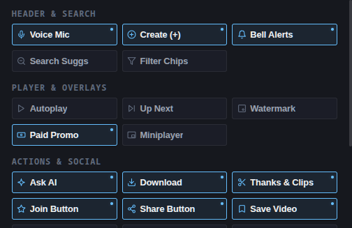

<p align="center">
  
</p>

<h1 align="center">Libertad — YouTube Focus & Distraction-Free</h1>

<p align="center">
  <strong>Reclaim your attention. Break algorithmic recommendation loops and experience YouTube with intention.</strong>
</p>

<p align="center">
  
  
  
  
  
</p>

<p align="center">
  
</p>

---

## Overview

Modern video platforms are engineered around algorithmic feedback loops designed to maximize watch time rather than viewer intention. **Libertad** is an ultra-lightweight, high-performance browser extension built with pure vanilla web standards. It gives you complete control over YouTube's user interface, eliminating clutter, recommendations, and manipulative engagement mechanics.

Whether you need a distraction-free environment for research and study, or a minimalist aesthetic tailored to OLED displays, Libertad lets you watch what you chose to watch—and nothing else.

---

## Key Features

### 1. Tri-Tab Ergonomic Navigation & Global Preset Bar
Libertad organizes controls into three purpose-built workspaces without vertical clutter, commanded by a top-level global preset bar:

<p align="center">
  
</p>

* **Focus Shield**: High-impact macro distraction blockers for algorithmic feeds, watch-next sidebars, comments, shorts, and end-screen cards.
* **UI Cleaner**: Surgical removal of 25 promotional, experimental, and clutter elements across YouTube's modern interface organized into 4 distinct categories.
* **Extras**: Dedicated power modules for YouTube data restorations (Public Dislikes API) and Title Untranslation.

<p align="center">
  
</p>

---

### 2. Instant Focus Presets (Integrated Matrix)
Switch between curated focus profiles with a single click or tailor your own (30 total toggles):

| Distraction / Clutter Element | OFF | BASIC | BALANCED *(Default)* | EXTREME *(Zen)* | CUSTOM |
| :--- | :---: | :---: | :---: | :---: | :---: |
| **Home Feed (Zen Search Mode)** | Shown | Shown | Shown | **Zen Prompt** | *Saved* |
| **Related Sidebar & Recommendations** | Shown | Shown | **Hidden** | **Hidden** | *Saved* |
| **Comments Stream** | Shown | **Hidden** | **Hidden** | **Hidden** | *Saved* |
| **Shorts Everywhere (Feeds & Nav)** | Shown | Shown | **Hidden** | **Hidden** | *Saved* |
| **End Screen Popup Cards** | Shown | **Hidden** | **Hidden** | **Hidden** | *Saved* |
| **Header (Voice, Create, Notifs)** | Shown | Shown | **Hidden** | **Hidden** | *Saved* |
| **Search Suggestions & Filter Chips** | Shown | Shown | Shown | **Hidden** | *Saved* |
| **Player Overlays (Up Next, Promo, Watermark)** | Shown | **Hidden** | **Hidden** | **Hidden** | *Saved* |
| **Autoplay & Miniplayer Controls** | Shown | Shown | **Hidden** | **Hidden** | *Saved* |
| **Promo Buttons (AI, Download, Merch)** | Shown | **Hidden** | **Hidden** | **Hidden** | *Saved* |
| **Monetization Buttons (Join, Thanks/Clips)** | Shown | Shown | **Hidden** | **Hidden** | *Saved* |
| **Social Actions (Share, Save, 3-Dots)** | Shown | Shown | Shown | **Hidden** | *Saved* |
| **Metrics (Likes/Dislikes, Views, Subs)** | Shown | Shown | Shown | **Hidden** | *Saved* |
| **Feeds (Live Chat, Trending, More from YT)** | Shown | Shown | **Hidden** | **Hidden** | *Saved* |

* **Off**: Clean passthrough mode; leaves YouTube completely unaltered.
* **Basic**: Removes common passive watch clutter (comments, end-screen cards, promotional download buttons, experimental AI popups, paid promo banners, watermarks, up next tiles, and merch shelves).
* **Balanced** *(Recommended Default)*: Breaks algorithmic recommendation feedback loops while keeping personal actions intact. Hides the sidebar, shorts, comments, voice search mic, create button, notifications bell, autoplay, up next, watermarks, paid promotions, miniplayer, AI button, download button, thanks/clips, channel memberships, merch shelves, live chat, trending, and "More from YouTube".
* **Extreme (Zen Mode)**: Complete distraction and engagement eradication. Replaces the homepage with an intentional minimalist search prompt, hides the sidebar, comments, shorts, header tools, player overlays, action bar (including likes/dislikes, share, save, 3-dots menu, subscribe button, subscriber count, views/date), live chat, and all browsing shelves.
* **Custom**: Automatically remembers and persists your individual fine-tuned preferences across all 30 switches in both tabs.

---

### 3. Granular Distraction Shields (Focus Tab)

* **Home Feed & Zen Mode**: Suppresses the infinite video recommendation grid on the homepage (`/`). When enabled, displays an intentional, minimalist search prompt that encourages purposeful searches rather than passive scrolling.
* **Related Sidebar & Auto-Centering**: Removes watch-next suggestions and algorithmically recommended videos beside the player. Automatically centers the main video player in theater style to prevent awkward whitespace.
* **Comments Section**: Hides the entire comment stream across all video watch pages to avoid engagement traps and toxic comment sections.
* **Shorts Eradication**: Strips Shorts shelves, navigation drawer links, mini-guide buttons, and feed entries across the entire YouTube interface.
* **End Screen Cards**: Suppresses popup overlay cards, subscribe buttons, and teaser cards that obstruct the final seconds of videos.

---

### 4. YouTube De-Bloating & Action Cleaner (Cleaner Tab)

Libertad provides 25 modular toggles organized into four specialized categories to clean modern YouTube:

<p align="center">
  
</p>

#### A. Header & Search Controls
* **Voice Search Mic**: Removes the microphone icon beside the main search bar for a cleaner masthead.
* **Create / Upload Button**: Suppresses the video creation and live broadcast button (`+`) in YouTube's top masthead bar.
* **Notifications Bell**: Suppresses the notification bell and alert badges to eliminate anxiety and notification rabbit holes.
* **Search Suggestions**: Hides the autocomplete search suggestion dropdown box to prevent algorithmic search hijacking.
* **Feed Filter Chips**: Suppresses the category topic chips bar located at the top of feeds and search results.

#### B. Player Controls & Overlays
* **Autoplay Toggle**: Hides the autoplay switch in the bottom video player control bar to prevent unintended binge-watching.
* **Up Next Overlay Tile**: Suppresses the countdown screen and "Up Next" preview tiles overlaying the video player.
* **Channel Branding Watermark**: Removes the floating creator watermark icon in the bottom-right corner of the video.
* **Paid Promotion / Sponsor Banners**: Suppresses the "Includes paid promotion" banner disclaimer overlaying the video.
* **Miniplayer Button**: Removes the picture-in-picture / miniplayer button from the player controls.

#### C. Action Bar & Social Engagement
* **Ask AI Assistant Button**: Suppresses YouTube's experimental conversational AI button on video watch pages.
* **Promotional Download Button**: Suppresses the download button and its overflow menu entries prompting users to purchase YouTube Premium.
* **Thanks, Clips & Remix**: Strips monetization and remixing action buttons from the primary video control bar.
* **Channel Memberships (Join Button)**: Suppresses the promotional "Join" / "Unirse" button beside the Subscribe button.
* **Video Share Button**: Suppresses the share button for an ultra-focused, cinema-grade watch experience.
* **Save to Playlist**: Suppresses the "Save" to playlist button from the primary video action bar.
* **Like / Dislike Bar**: Strips the thumbs up and thumbs down action buttons from the player metadata row.
* **Subscribe Button**: Suppresses the channel Subscribe button to avoid audience capture traps.
* **Subscriber Count**: Hides the channel subscriber count to prevent social proof bias.
* **View Count & Upload Date**: Suppresses public view counts and publication dates beneath the video title.
* **3-Dots Overflow Menu**: Suppresses the 3-dots "More actions" (`...`) button on the watch action bar and removes the "Report" / "Denunciar" option from overflow menus.

#### D. Feeds & Navigation Shelves
* **Merch & Shopping Shelves**: Suppresses shopping carousels, affiliate product shelves, and store banners below videos.
* **Live Chat Stream & Replay**: Suppresses the live chat sidebar, chat replay, and live comment box during premieres and streams.
* **Trending & Explore**: Strips Trending, Movies, and Explore links from the left guide drawer and feed sections.
* **More From YouTube**: Suppresses YouTube Premium, YouTube Studio, YouTube Music, and YouTube Kids sections in the navigation drawer.

---

### 5. Auxiliary Power Modules

* **Restore YouTube Dislikes**:
  * Seamlessly connects to the community-driven [Return YouTube Dislike API](https://returnyoutubedislikeapi.com).
  * Injects public dislike metrics directly into the native YouTube action bar with localized formatting (`1.4K`, `25M`).
  * Features an in-memory cache to prevent redundant network requests and maximize responsiveness.

* **Title Untranslation Engine**:
  * Reverses YouTube's forced automatic translations, restoring the creator's original video title in the original language.
  * Operates across both watch pages and video feeds using an `IntersectionObserver` viewport scanner with bounded concurrency (`MAX_CONCURRENT_FEED_FETCHES = 3`) to eliminate redundant traffic and prevent rate limits.

* **Skip In-Video Sponsors (SponsorBlock Engine)**:
  * Automatically detects and skips sponsored segments, creator self-promotions, intros, and subscribe reminders without requiring manual interaction.
  * Connects to the open [SponsorBlock](https://sponsor.ajay.app) community database, showing a subtle on-screen toast whenever a segment is skipped.
  * Driven by native HTML5 `<video>` playback events and an in-memory segment cache for 0.0% idle CPU overhead.

---

### 6. Interface & Ergonomics

<p align="center">
  
</p>

* **Tri-Theme Engine**:
  * **Dark**: Industrial graphite palette with high readability.
  * **Light**: Clean, high-contrast laboratory aesthetic.
  * **OLED**: Pure `#000000` pitch black engineered for OLED displays and maximum power efficiency.
* **UI Display Scaling**:
  * One-touch zoom controls for popup comfort: **1x** (Standard), **1.2x** (Optimized for 1440p displays), and **1.4x** (Optimized for 4K / high-DPI displays).
* **Bilingual Localization (i18n)**:
  * Full runtime translation between **English (EN)** and **Spanish (ES)** for all popup controls and tooltips, alongside native Chrome `_locales` support.

---

## Technical Architecture & Performance

* **Zero External Runtime Dependencies**: Built with 100% pure Vanilla JavaScript, modern HTML5, and CSS variables. Zero npm bloat, zero bundlers required.
* **Instant Injection (`document_start`)**: Stylesheet rules are injected dynamically at DOM initialization to eliminate Flash of Unstyled Content (FOUC).
* **SPA Lifecycle Integration**: Listens directly to YouTube's internal single-page navigation events (`yt-navigate-finish`) to ensure styles and modules stay synchronized across client-side page transitions.
* **Local-First Storage**: User settings and custom toggle states are persisted via `chrome.storage.sync`, synchronizing seamlessly across all logged-in browser instances.
* **Bounded LRU Memory Cache**: In-memory stores for titles and public dislike metrics are strictly capped with LRU eviction to prevent memory leaks during long-running SPA sessions.
* **Manifest V3 Compliant**: Built strictly adhering to the latest Chrome Extension security standards.

---

## Installation (Developer Mode)

To install and test Libertad locally in any Chromium-based browser (Google Chrome, Brave, Edge, Opera, Vivaldi):

1. Clone or download this repository:
   ```bash
   git clone https://github.com/HumbleDev-tech/Focus_extension.git
   ```
2. Open your browser and navigate to the extensions management page:
   * **Chrome / Brave**: `chrome://extensions/`
   * **Edge**: `edge://extensions/`
3. Enable **Developer mode** via the toggle switch in the top-right corner.
4. Click **Load unpacked** and select the root directory of this repository (`Focus_extension`).
5. Pin **Libertad** to your browser toolbar and open [YouTube](https://www.youtube.com).

---

## Development & Quality Checks

This project uses **[Biome](https://biomejs.dev)** for ultra-fast linting, formatting, and accessibility checks:

```bash
# Check formatting, linter rules, and syntax standards
npm run check

# Automatically format all source files
npm run format

# Run linter only
npm run lint
```

---

## Building & Packaging

The repository includes an automated packaging script to build clean distribution `.zip` archives ready for upload to the [Chrome Web Store Developer Dashboard](https://chrome.google.com/webstore/devconsole):

### Using npm:
```bash
npm run pack
```

### Using Python:
```bash
python3 pack.py
```

The script automatically filters out git metadata, editor files, and temporary artifacts, outputting `libertad-extension.zip`.

---

## Privacy & Security

Libertad is built on strict privacy-first principles:

* **Zero Telemetry**: Contains no tracking scripts, analytics, or behavioral loggers.
* **On-Device Execution**: All preferences and configurations are stored locally or synced strictly within your browser's private `chrome.storage.sync`.
* **Minimal Permissions**: Requests only the permissions strictly necessary to function (`storage` and YouTube host access).

Read our full [Privacy Policy](PRIVACY.md) for complete details.

---

## Acknowledgements

Libertad is built on open standards and stands on the shoulders of exceptional open-source projects and community initiatives:

* **[Return YouTube Dislike](https://returnyoutubedislike.com)**: For providing the public community API and infrastructure that powers our dislike metric restoration module.
* **[SponsorBlock](https://sponsor.ajay.app)**: For providing community-curated sponsorship timestamps licensed under [CC BY-NC-SA 4.0](https://creativecommons.org/licenses/by-nc-sa/4.0/). Uses SponsorBlock data from [https://sponsor.ajay.app/](https://sponsor.ajay.app/).
* **[Feather Icons](https://feathericons.com)** / **[Lucide](https://lucide.dev)**: For the clean, open-source SVG line iconography utilized across the popup control surface.
* **[Biome](https://biomejs.dev)**: For providing world-class, ultra-fast formatting and linting tooling.
* **Distraction-Free Community**: Inspired by the pioneering ethos of tools like *Unhook* and *DF Tube*, re-engineered with zero runtime dependencies and modern Manifest V3 standards.

---

## Support & Donations <a id="support--donations"></a>

Libertad is **100% free, unmonetized, and open-source** under the MIT license. We believe essential focus and digital sovereignty tools should belong to everyone without paywalls, subscriptions, or telemetry.

If Libertad saves you hours of distraction and you'd like to support continued development, maintenance, and new features, voluntary contributions are deeply appreciated:

* **GitHub Sponsors**: [Sponsor @HumbleDev-tech](https://github.com/sponsors/HumbleDev-tech)
* **Buy Me a Coffee**: [buymeacoffee.com/humbledev](https://www.buymeacoffee.com)
* **Ko-fi**: [ko-fi.com/humbledev](https://ko-fi.com)

Every bit of support fuels independent, open-source software built for user autonomy.

---

## License

This project is open-source software licensed under the **[MIT License](LICENSE)**.  
Created and maintained by **[HumbleDev-tech](https://github.com/HumbleDev-tech)**.

