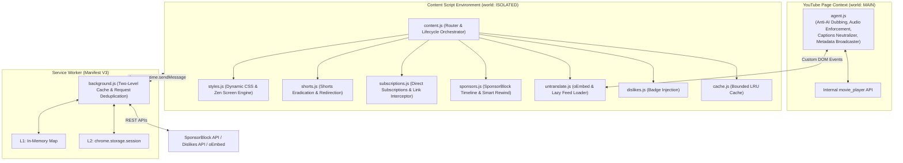

<p align="center">
  
</p>

<h1 align="center">Libertad for YouTube</h1>

<p align="center">
  <strong>Reclaim your attention. Watch what you actually chose to watch — without feeds, shorts, clutter, or forced AI dubs pulling you in.</strong>
</p>

<p align="center">
  
  
  
  
  
  
</p>

---

## Why Libertad?

Ever opened YouTube just to check a quick tutorial or research a topic, only to find yourself an hour later trapped in a rabbit hole of algorithmic recommendations, endless Shorts, and clickbait?

Modern YouTube is engineered around keeping you clicking. Between infinite feeds, notification badges, synthetic AI audio dubs replacing creators' real voices, and intrusive overlays, watching intentionally has become an uphill battle.

I built **Libertad** to change that. It is a lightweight, distraction-free layer designed to give you peace of mind and complete control over your viewing experience:

* **Pure Performance (Zero Bloat):** 100% Vanilla JavaScript. No heavy frameworks, no React overhead, and zero runtime dependencies. It boots synchronously at page load with zero flicker and negligible memory usage.
* **Up to 3 Custom Focus Profiles:** Create personalized profiles on demand (e.g. *Study*, *Work*, *Podcasts*). Each profile maintains its own independent memory and can be renamed inline with a single click.
* **Zen Mode Home:** Replaces the addictive infinite homepage with a calm, intentional screen that keeps your attention on the search bar.
* **Shorts Eradication & Smart Redirection:** Completely clears out Shorts carousels and tabs, and automatically turns any `/shorts/` link back into a standard desktop video with full playback controls.
* **Original Audio & Anti-AI Dubbing:** Bypasses YouTube's forced synthetic AI voiceovers, locking playback to the creator's genuine voice while restoring original titles, descriptions, and chapters.
* **SponsorBlock with Forgiving Controls:** Skips sponsorships, intros, and reminders with colored timeline markers, an instant **Unskip** button, and **Smart Manual Rewind Detection** (if you scrub back to see something, it understands and lets you watch).
* **Restores Public Dislikes:** Seamlessly integrates public community dislike counts directly into YouTube's native buttons.
* **Privacy by Default:** Zero tracking, zero analytics, zero data collection. Everything stays locally in your browser.

---

## Table of Contents

* [Focus Profiles & Presets](#focus-profiles--presets)
* [Feature Tour](#feature-tour)
  * [Focus Shield (Macro Distraction Blockers)](#1-focus-shield)
  * [UI Cleaner (Decluttering the Interface)](#2-ui-cleaner)
  * [Extras & Power Modules](#3-extras--power-modules)
* [Themes & Ergonomics](#themes--ergonomics)
* [Under the Hood (Architecture)](#under-the-hood)
* [Installation](#installation)
* [Development](#development)
* [Project Structure](#project-structure)
* [Privacy](#privacy)
* [Acknowledgements](#acknowledgements)
* [Support the Project](#support-the-project)
* [License](#license)

---

## Focus Profiles & Presets

Libertad is designed with **Progressive Disclosure**: zero friction out of the box, with full personalization when you want it.

### 1. Quick Mode (Zero-Friction Baseline)
When you install Libertad, you start in **Quick Mode**. No pre-created profiles or complex setup required. Simply choose your preferred level of focus with one click:

* **OFF:** Default YouTube state with all algorithmic feeds visible.
* **BASIC *(Default)*:** Everyday baseline. Suppresses shorts, intrusive overlays, promo buttons, and end screens.
* **BALANCED:** Optimal balance. Suppresses sidebar recommendations, shorts, autoplay, and clutter while keeping comments open.
* **EXTREME *(Zen)*:** Pure minimalist focus. Centered player, Zen search-only home screen, and zero metrics or comments.

### 2. Custom Profiles (Up to 3 Slots)
Whenever you fine-tune switches to your liking, save your configuration with **`+ Save as Profile`**:
* **Name it your way:** Give it a meaningful name (e.g., *Study*, *Podcasts*, *Evening*).
* **Switch seamlessly:** Click any profile chip to load its preferences instantly.
* **Non-Destructive Independence:** Base presets and custom profiles are completely independent. Switching to a base preset (OFF, BASIC, BALANCED, EXTREME) engages that mode immediately without ever modifying or overwriting your saved custom profiles. You can switch back to any saved profile at any time with its exact settings preserved.

### Preset Matrix Overview

| Feature / Element | OFF | BASIC *(Default)* | BALANCED | EXTREME *(Zen)* |
| :--- | :---: | :---: | :---: | :---: |
| **Home Feed (Zen Screen)** | Shown | Shown | Shown | **Minimal Search** |
| **Direct to Subscriptions** | Off | Off | Off | Off |
| **Related Sidebar & Up Next** | Shown | Shown | **Hidden** | **Hidden** |
| **Shorts (Shelves, Nav & Redirects)** | Shown | **Hidden** | **Hidden** | **Hidden** |
| **End Screen Cards & Teasers** | Shown | **Hidden** | **Hidden** | **Hidden** |
| **Comments Stream & Panels** | Shown | Shown | Shown | **Hidden** |
| **Header (Voice Mic, Create, Bell)** | Shown | Shown | **Hidden** | **Hidden** |
| **Search Suggestions & Filter Chips** | Shown | Shown | Shown | **Hidden** |
| **Player Overlays & Watermarks** | Shown | **Hidden** | **Hidden** | **Hidden** |
| **Autoplay, Miniplayer & Play on TV** | Shown | Shown | **Hidden** | **Hidden** |
| **Subtitles / Closed Captions (CC)** | Shown | Shown | Shown | **Hidden** |
| **Promotional (Ask AI, Download, Merch)** | Shown | **Hidden** | **Hidden** | **Hidden** |
| **Monetization (Join, Thanks, Clips)** | Shown | Shown | **Hidden** | **Hidden** |
| **Social Actions (Share, Save, 3-Dots)** | Shown | Shown | Shown | **Hidden** |
| **Video Metrics (Likes, Views, Subs)** | Shown | Shown | Shown | **Hidden** |
| **Feeds (Live Chat, Trending, More from YT)** | Shown | Shown | **Hidden** | **Hidden** |

*(Fine-tuning any switch marks the badge as `CUSTOM` so you know your setup is personalized).*

---

## Feature Tour

Controls inside the popup are organized into three clean tabs:

### 1. Focus Shield

Macro blockers for YouTube's biggest time sinks:

* **Zen Mode Home Screen:** Instead of an endless wall of algorithmic videos, your homepage displays a sleek, calm card with a live focus reticle and a simple reminder to use the search bar. It matches your active theme (Dark, Light, OLED) and DPI scale.
* **Direct to Subscriptions:** Prefer jumping straight to the channels you already care about? Turn this on to have the homepage route directly to `/feed/subscriptions`. Includes native click interception so clicking the YouTube logo routes you without refreshing.
* **Auto-Centered Watch Player:** Hiding the recommended sidebar automatically centers the video player on your screen (`max-width: 1100px; margin: 0 auto;`), creating an immersive, cinema-like experience.
* **Shorts Eradication & Smart Redirect:**
  * Hides Shorts carousels, navigation links, and channel tabs.
  * **Smart Redirect Engine:** If you click or paste a `/shorts/VIDEO_ID` URL, Libertad automatically loads it inside the standard desktop player (`/watch?v=VIDEO_ID`), giving you back timeline scrubbing, speed modifiers, theater mode, and normal playback controls. Preserves timestamps (`?t=`), playlist context (`?list=`), and hash anchors (`#`).
* **No More End-Screen Clutter:** Blocks floating video cards and pop-up teasers right as a video is ending.
* **Comments Toggle:** Turn off the comments stream whenever you want to absorb content without getting pulled into debate sections.

---

### 2. UI Cleaner

A modular grid of 28 granular toggles across 5 clear categories to remove visual noise:

* **Header & Search:** Hide the voice search microphone, the "+" Create button, notifications bell, autocomplete suggestions, and feed filter topic chips.
* **Player & Overlays:** Hide the autoplay switch, the up-next countdown overlay, channel watermarks, "Includes paid promotion" badges, the miniplayer button, **Play on TV** (Cast/Remote buttons and overlays), and **Subtitles** (Closed Captions / CC button and caption overlays).
* **Action Buttons:** Strip clutter from the action bar: hide Ask AI, Download, Thanks & Clips, Join/Membership, Share, Save to playlist, and the 3-dots overflow menu.
* **Metrics & Social Counters:** Hide the Like/Dislike button group, subscribe button, channel subscriber counts, and view/date counts.
* **Feeds & Navigation:** Hide merch and shopping shelves, live stream chat and chat replays (with automatic Polymer player expansion), explore/trending links, and "More from YouTube" sidebar links.

---

### 3. Extras & Power Modules

Community-powered utilities built right into the extension:

#### Restore Public Dislikes
Integrates with the public [Return YouTube Dislike API](https://returnyoutubedislikeapi.com) to bring back dislike counts next to the thumbs-down button, formatted cleanly for your locale (`1.2K`, `50M`).

#### Smart SponsorBlock Integration
Skips sponsored segments, intros, and reminders using community data from [SponsorBlock](https://sponsor.ajay.app):

* **Color-Coded Timeline:** Visual markers directly on YouTube's player bar showing where segments start and end (Green for Sponsors, Yellow for Self-promo, Purple for Interaction, Cyan for Intros, Blue for Outros, Orange for Non-music segments).
* **6 Configurable Categories:** Pick exactly what you want to skip from the popup (e.g. skip paid sponsors and intros, but keep self-promotions).
* **Rich On-Screen Toast:** Shows what was skipped and how much time was saved (e.g., `SPONSOR SKIPPED · 18s`).
* **Interactive Undo Button:** Want to see what was skipped? Hit **"UNSKIP" / "DESHACER"** on the toast to jump right back.
* **Smart Rewind Detection:** Prefer using your keyboard or mouse? If you manually scrub back into a skipped segment (using <kbd>J</kbd> or arrow keys), Libertad notices the rewind, cancels the skip, and lets you watch uninterrupted. If you rewind further back, it re-arms the skip automatically.

#### Untranslate & Anti-AI Dubbing Suite
Ever get annoyed when YouTube forces an unnatural synthetic AI voiceover on an international video, or translates video titles into awkward clickbait?

* **Anti-AI Dubbing:** Runs an isolated agent in YouTube's page context that inspects internal player audio tracks across 15+ languages and automatically switches playback back to the creator's authentic, original voice.
* **Original Titles:** Restores the true, non-translated titles on watch pages (via instant same-origin oEmbed) and across feeds (using smooth, viewport-based lazy loading).
* **Original Descriptions & Chapters:** Restores original creator descriptions (both expanded and preview) and parses genuine chapter titles without breaking YouTube's layout.
* **Native Captions:** Clears algorithmic auto-translation layers so you can read authentic subtitles.

---

## Themes & Ergonomics

* **Themes:**
  * **Auto:** Synchronizes with your system or YouTube's current light/dark state.
  * **Dark:** Sleek, modern dark palette (`#131722`).
  * **Light:** Crisp, clean, high-contrast light mode (`#ffffff`).
  * **OLED Black:** Pure black (`#000000`) for maximum contrast and battery savings on OLED / AMOLED laptop screens.
* **UI Scaling:**
  * Auto-detects screen resolution and DPI.
  * Manual scaling options: **1x** (standard), **1.2x** (1440p / 2K), and **1.4x** (4K / ultrawide displays). Scales the popup, the Zen screen, and the player toast seamlessly.
* **Multi-Language Support:**
  * Fully localized in **English (EN)**, **Spanish (ES)**, and **Portuguese (PT)** with automatic regional detection (`es-ES`, `es-419`, `pt-BR`, `pt-PT`).

---

## Under the Hood

For developers and curious users, here is how Libertad is architected for speed and zero memory leakage:



* **Memoized Dynamic Stylesheet (0 ms SPA Cost):** Compiles the dynamic CSS rules into memory with hash fingerprinting (`getStylesheetKey`), reducing recalculation and re-parsing overhead during YouTube SPA navigations to strictly **0 ms**.
* **Zero-Latency Popup Hydration (Frame 0 Render):** Synchronously hydrates popup state from `localStorage` (`libertad_popup_state`) upon opening, completely eliminating the 30-80 ms layout pop-in / flicker before reconciling with `chrome.storage.sync`, paired with optimistic UI persistence.
* **Fault Isolation Barriers (`safeRun`):** Each module runs inside a defensive execution boundary so unexpected Polymer DOM shifts or API interruptions in one module can never crash the orchestrator or degrade other features.
* **CSS Layout Containment (`contain: content`):** Isolates internal DOM layout and style recalculations of each popup panel, preventing unnecessary browser reflows and repaints during tab switching.
* **Smooth 60fps Feed Processing:** Eliminates continuous scroll event listeners in favor of debounced `MutationObserver` triggers and an O(1) fast-path for processed video nodes, guaranteeing buttery-smooth scrolling without CPU thrashing.
* **Dual-Layer Background Caching:** Implements an in-memory L1 cache and an L2 `chrome.storage.session` cache so fetched metadata survives Service Worker suspensions in Manifest V3.
* **In-Flight Request Deduplication:** If multiple cards request data for the same video simultaneously, they share a single pending Promise, preventing duplicate HTTP requests.
* **Anti-FOUC Startup:** Syncs settings from `sessionStorage` at `document_start` so styles apply before the browser paints, completely eliminating layout flashes.
* **Extension Context Invalidation Resilience:** Defensive messaging barriers protect background calls against extension reload/update disconnections.
* **Fast-Path DOM Caching:** Reuses verified DOM elements instead of repeatedly calling `querySelector`.

---

## Installation

Works on any Chromium-based browser (Chrome, Brave, Edge, Opera, Vivaldi, Arc):

1. Clone or download this repository:
   ```bash
   git clone https://github.com/HumbleDev-tech/Focus_extension.git
   ```
2. Open your browser extensions page:
   * **Chrome / Brave:** `chrome://extensions/`
   * **Edge:** `edge://extensions/`
3. Enable **Developer mode** (toggle in the top-right corner).
4. Click **Load unpacked** and select the `Focus_extension` folder.
5. Pin **Libertad** to your toolbar and open [YouTube](https://www.youtube.com).

---

## Development

Code formatting and linting are powered by [Biome](https://biomejs.dev):

```bash
# Check formatting and linting
npm run check

# Auto-format codebase
npm run format

# Build clean distribution zip for Chrome Web Store
npm run pack
```

---

## Project Structure

```text
Focus_extension/
├── _locales/              # Translations for Web Store manifest (en, es, pt_BR, pt_PT)
├── icons/                 # Extension iconography (16, 48, 128px)
├── src/
│   ├── core/              # Utility helpers
│   │   ├── cache.js       # Bounded LRU Cache implementation
│   │   └── utils.js       # Video ID parsers, locale helpers & number formatting
│   ├── injected/          # Scripts executed in main page context
│   │   └── agent.js       # MAIN world agent (Anti-AI dubbing & audio API)
│   └── modules/           # Feature-specific engines
│       ├── dislikes.js    # Return YouTube Dislike integration
│       ├── shorts.js      # Shorts eradication & desktop player redirection
│       ├── sponsors.js    # SponsorBlock engine, visual timeline & rewind unskip
│       ├── styles.js      # Dynamic stylesheet generator & Zen card interface
│       ├── subscriptions.js # Direct subscriptions router & SPA link interceptor
│       └── untranslate.js # Title, description, caption & chapter restoration
├── background.js          # Service worker with dual-layer caching
├── constants.js           # Single source of truth for toggles, presets & profiles
├── content.js             # SPA lifecycle router and module orchestrator
├── i18n.js                # UI translation dictionary (EN, ES, PT)
├── popup.html             # Tri-tab popup control surface
├── popup.css              # Design system with Dark, Light, and OLED themes
├── popup.js               # Popup interactions, profile management & auto-scale
├── theme-init.js          # Synchronous anti-FOUC theme bootstrapper
├── manifest.json          # Manifest V3 extension configuration
├── pack.py                # Automated extension packager
└── biome.json             # Biome formatting and linting rules
```

---

## Privacy

Libertad is built on strict privacy principles:

* **Zero Telemetry:** No tracking, no user analytics, no behavioral logs.
* **On-Device Storage:** All preferences and profile names are stored locally in your browser's private `chrome.storage.sync`.
* **Minimal Permissions:** Only requests access to `storage` and YouTube domains. Public API requests (Dislikes, SponsorBlock, oEmbed) only transmit public 11-character video IDs when those specific features are turned on.

Read our complete [Privacy Policy](PRIVACY.md).

---

## Acknowledgements

Special thanks to the open-source projects that make Libertad possible:

* **[Return YouTube Dislike](https://returnyoutubedislike.com):** For public dislike counter metrics.
* **[SponsorBlock](https://sponsor.ajay.app):** For community-sourced sponsorship timestamps (licensed under [CC BY-NC-SA 4.0](https://creativecommons.org/licenses/by-nc-sa/4.0/)).
* **[Feather Icons](https://feathericons.com) & [Lucide](https://lucide.dev):** For clean UI iconography.
* **[Biome](https://biomejs.dev):** For lightning-fast linting and formatting.
* **Distraction-Free Community:** Inspired by the minimalist philosophy of open-source focus tools.

---

## Support the Project

Libertad is 100% free and open-source. If it saves you hours of distraction, helps your studies, or makes YouTube a calmer place to be, buying me a coffee is a great way to support ongoing maintenance:

**[Support on Ko-fi](https://ko-fi.com/humbledevtech)**

---

## License

Released under the **[MIT License](LICENSE)**.  
Created and maintained with care by **[HumbleDev-tech](https://github.com/HumbleDev-tech)**.
